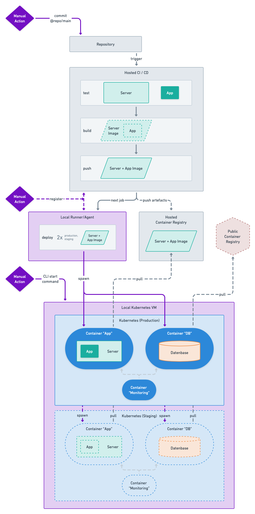

# devops-app-infra

**_Infrastructure as Code for the life cycle of [devops-app](https://github.com/kelzenberg/devops-app)._**

## Project Concept

This concept describes the connection and life cycle between a hosted platform and a local system to achieve an automated local deployment.

### Requirements

The deployment of the server+app must happen locally on a system, capable of running multiple container instances. However, the build artefacts are stored on a hosted platform.  
After the initial deployment, the deployed code must remain updatable and the containers can be scaled at will (within the limits of the host system).

The hosted platform must offer a list of features to enable local deployments, such as but not only: repositories, actions, container registries and local agents/runners.

### Environments

- K8s namespace `production` and `staging`

### Life Cycle

_(Visualization of the entire life cycle below)_

The local system must allocate a local kubernetes (VM) of sorts with basic access to the cluster. Initially a CLI command to start the local kubernetes (VM) is required to run once.

The CI/CD pipeline will be automatically triggered by a Git commit to the main branch on the hosted repository. The local agent/runner on the same system will then access the local kubernetes whenever one of its action is being executed.

### Technologies & Platforms

- **VCS:** [`Git`](https://git-scm.com)
- **Repository:** [`GitHub`](https://github.com) (hosted)
- **Server:** [`NodeJS`](https://nodejs.org) + [`Express`](https://expressjs.com)
- **App:** [`TypeScript App (static)`](https://www.typescriptlang.org)
- **CI/CD:** [`GitHub Actions`](https://docs.github.com/en/actions) (hosted)
- **Public Container Registry:** `TBD` (hosted) <!-- TODO e.g. Dockerhub? -->
- **Database:** [`PostgreSQL`](https://www.postgresql.org)
- **Runner:** [`GitHub Self-hosted Runners`](https://docs.github.com/en/actions/hosting-your-own-runners/about-self-hosted-runners) (local)
- **Private Container Registry:** [`GitHub Container Registry`](https://docs.github.com/en/packages/working-with-a-github-packages-registry/working-with-the-container-registry) (hosted)
- **Kubernetes (VM):** [`Minikube`](https://minikube.sigs.k8s.io/docs/start) (local)
- **Monitoring:** [`Prometheus`](https://prometheus.io) + [`Grafana`](https://grafana.com) (local)
